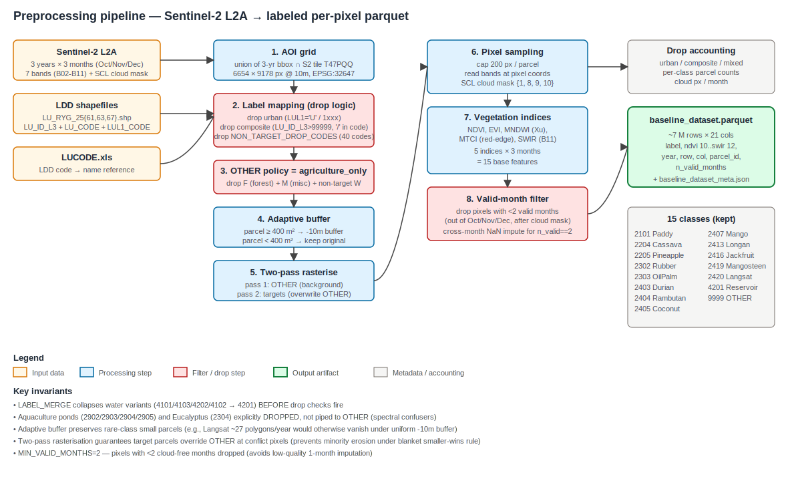
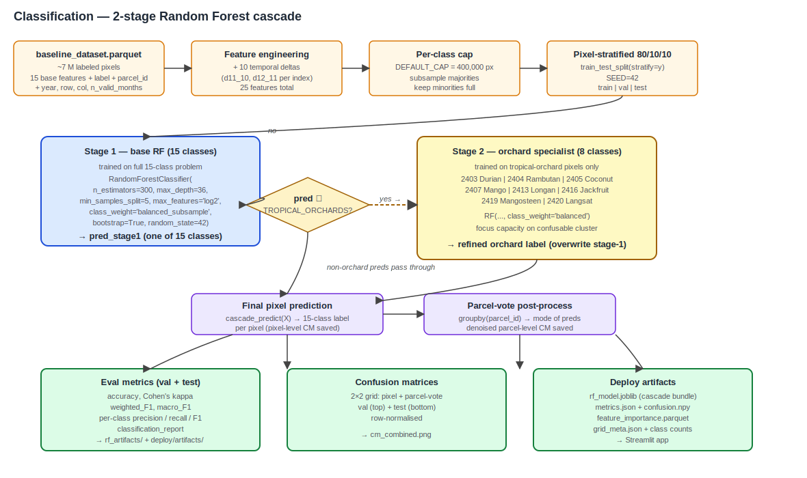

# Rayong Crop Classification — Preprocessing & Model Workflow

End-to-end pipeline for per-pixel crop classification of Rayong Province, Thailand using Sentinel-2 L2A imagery and Land Development Department (LDD) land-use shapefiles.

**Output**: 15 classes (14 target crops + OTHER) at 10 m resolution across years 2018, 2020, 2024.

---

## 1. High-level architecture



The pipeline produces `baseline_dataset.parquet` from raw Sentinel-2 + LDD shapefiles, then trains a 2-stage Random Forest cascade for classification.

---

## 2. Inputs

| Source | Description | Coverage |
|---|---|---|
| **Sentinel-2 L2A** | `.SAFE.zip` — 7 bands (B02, B03, B04, B05, B06, B08, B11) + SCL cloud mask | 3 months × 3 years (Oct/Nov/Dec for 2018, 2020, 2024) |
| **LDD shapefiles** | LU_RYG_25{61,63,67}.shp — parcel polygons + LDD codes (`LU_ID_L3`, `LU_CODE`, `LUL1_CODE`) | Rayong Province, Thai BE years 2561 / 2563 / 2567 |
| **LUCODE.xls** | LDD code reference (Thai/English crop names) | Province-wide |

LDD numeric encoding: `Axxx → 2X00` (paddy/field/perennial/orchard), `Fxxx → 3xxx` (forest), `Wxxx → 4xxx` (water), `Mxxx → 5xxx` (misc), `Uxxx → 1xxx` (urban).

---

## 3. Preprocessing pipeline

### 3.1 AOI grid

- Reference grid: union of three years' shapefile bbox ∩ Sentinel-2 tile T47PQQ (EPSG:32647 / UTM zone 47N)
- 10 m pixel size, snapped to S2 native grid
- Final AOI: 6,654 × 9,178 pixels (~61 M pixels)

### 3.2 Label mapping (4-belt drop logic)

Polygons are dropped if they match any of:

| Belt | Rule | Reason |
|---|---|---|
| 1 | `LUL1_CODE == 'U'` or `LU_ID_L3 ∈ [1000, 2000)` | Urban (non-agricultural) |
| 2 | `LU_ID_L3 > 99999` | Numeric composite (mixed-crop polygon, e.g. 220512302) |
| 3 | `'/' in LU_CODE` | Letter-form composite (e.g. `A205/A302`) |
| 4 | `LU_ID_L3 ∈ NON_TARGET_DROP_CODES` | Single mixed/abandoned/aquaculture/eucalyptus codes |

Plus, under `OTHER_POLICY='agriculture_only'`: drop forest (`LUL1='F'`), miscellaneous (`LUL1='M'`), and non-target water (`LUL1='W'`) polygons.

`LABEL_MERGE` collapses water variants prior to drop check: `4101/4103/4202/4102 → 4201` (Reservoir).

`NON_TARGET_DROP_CODES` (40 codes total):
- Mixed-plant: 2401 mixed orchard, 2301 mixed perennial, 2201 mixed field, 2501 mixed horticulture, 2601 mixed shifting, 2801 mixed aquatic, 2901 mixed aquaculture, 2001 integrated farm
- Abandoned: 2100, 2200, 2300, 2400, 2500, 2700, 2900
- Aquaculture water ponds (water-like spectral signature): 2902 Fish, 2903 Shrimp, 2904 Crab/Shellfish, 2905 Crocodile
- Eucalyptus: 2304 (spectrally near rubber/oil palm)

After label mapping: target codes retained, all other agricultural codes mapped to OTHER (9999).

### 3.3 Adaptive buffer

Standard practice applies a uniform negative buffer (e.g., −10 m) to dodge edge mixed-pixels. This empties small parcels entirely, eroding rare classes (Langsat: 27 polygons, mostly small).

**Adaptive scheme**:
- Parcel area ≥ 400 m² (≥ 4×4 pixels post-buffer): apply −10 m buffer.
- Parcel area < 400 m²: keep original geometry.

This preserves minority classes at the cost of mild edge mixed-pixel noise.

### 3.4 Two-pass rasterisation

To prevent OTHER polygons from over-writing target parcels at conflict pixels:

| Pass | Layers | Within-pass rule |
|---|---|---|
| 1 | OTHER (9999) parcels only | Sort by area DESC → smaller wins |
| 2 | Target parcels only | Sort by area DESC → smaller wins; **always overwrites Pass 1** |

Result: targets always priority over OTHER; within targets, smaller parcels (Langsat) win over larger (Durian) at any overlap.

### 3.5 Pixel extraction

For each year, for each labeled pixel:

1. Cap per parcel to 200 pixels (`MAX_PIXELS_PER_PARCEL = 200`) — prevents one giant parcel from dominating training.
2. Read 7 bands × 3 months at pixel location.
3. Compute 5 vegetation indices per month (15 features total).
4. Mask cloudy or no-data pixels using SCL cloud classes {1, 8, 9, 10}.
5. Track per-pixel valid-month mask (0–3 valid months).

### 3.6 Vegetation indices

| Index | Formula | Role |
|---|---|---|
| `ndvi` | (B08 − B04) / (B08 + B04) | Vegetation greenness |
| `evi` | 2.5 · (B08 − B04) / (B08 + 6·B04 − 7.5·B02 + 1) | Atmospheric-resistant greenness |
| `mndwi` | (B03 − B11) / (B03 + B11) | Modified NDWI (Xu 2006) — surface water detection |
| `mtci` | (B06 − B05) / (B05 − B04) | Red-edge / chlorophyll content |
| `swir` | B11 (passthrough) | Dryness / soil moisture proxy |

### 3.7 Valid-month policy + cross-month NaN imputation

Pixels with fewer than 2 valid months (out of Oct/Nov/Dec) are dropped. For pixels with exactly 2 valid months, the missing month is imputed from the per-pixel mean of the other two months. Pixels with 3 valid months stay untouched.

### 3.8 Output

`baseline_dataset.parquet` — ~7 M rows × 21 columns:

```
columns = [label, ndvi 10..swir 12 (15), year, row, col, parcel_id, n_valid_months]
```

Plus `baseline_dataset_meta.json` with AOI transform/CRS, drop accounting, per-year statistics.

---

## 4. Feature engineering (training-side)

Training features = base + delta:

| Feature group | Count | Description |
|---|---|---|
| Base indices | 15 | 5 indices × 3 months (Oct/Nov/Dec) |
| Temporal deltas | 10 | Per index: Nov−Oct + Dec−Nov (`d11_10`, `d12_11`); captures non-monotonic phenology (e.g., paddy peaks Nov then drops Dec at harvest) |
| **Total** | **25** | |

The third possible delta (Dec−Oct) is omitted because RF can derive it from the sum of the other two.

**Note on parcel-mean features:** an earlier prototype added per-parcel mean features (15 features). These were removed because they leak class identity under pixel-stratified splits — same parcel appears in train+val+test, and parcel-mean acts as a perfect class fingerprint for the parcel's val/test pixels. Removing them gives honest test metrics.

---

## 5. Classification model



### 5.1 Per-class pixel cap

Before splitting, each class is capped at `DEFAULT_CAP = 400_000` pixels. Minority classes (e.g., Langsat: ~5K pixels) are kept fully; majority classes (Cassava, Rubber: 1–10 M raw pixels) are randomly subsampled to 400K.

### 5.2 Train / val / test split

Pixel-level stratified 80 / 10 / 10 split via `train_test_split(stratify=y)` (paper baseline).

Adjacent pixels of the same parcel may appear across train/val/test, producing slightly optimistic test scores compared to evaluating on unseen parcels. This is a deliberate trade-off: parcel-grouped splits (`StratifiedGroupKFold`) collapse tiny minorities (Langsat with 27 polygons can have all parcels in a single fold). Pixel-stratified splitting guarantees every class is scored.

### 5.3 Stage-1 — base Random Forest (15 classes)

```python
RF_PARAMS = dict(
    n_estimators=300, max_depth=36, min_samples_split=5, min_samples_leaf=1,
    max_features='log2', class_weight='balanced_subsample', bootstrap=True,
    n_jobs=-1, random_state=42,
)
```

Trained on the full 15-class problem with `class_weight='balanced_subsample'` to handle class imbalance per bootstrap sample.

### 5.4 Stage-2 — tropical-orchard specialist

Eight classes form a tropical-orchard cluster that confuses heavily at the pixel level (broadleaf evergreen, similar canopy, similar phenology):

```
2403 Durian, 2404 Rambutan, 2405 Coconut, 2407 Mango,
2413 Longan, 2416 Jackfruit, 2419 Mangosteen, 2420 Langsat
```

A second RF (`clf_orchard`) is trained **only on tropical-orchard pixels** with `class_weight='balanced'`, focusing model capacity on this cluster.

### 5.5 Cascade prediction

```python
def cascade_predict(X):
    pred = clf.predict(X)                        # stage-1: 15-class
    mask = isin(pred, TROPICAL_ORCHARDS)
    if mask.any():
        pred[mask] = clf_orchard.predict(X[mask])  # stage-2: 8-class refinement
    return pred
```

Stage-1 partitions the 15-class space; pixels predicted as any tropical-orchard class are re-classified by Stage-2.

### 5.6 Parcel-vote post-processing

For aggregated reporting, per-pixel predictions are grouped by `parcel_id`; the parcel label is the **mode** of pixel predictions in that parcel. Reduces per-pixel noise (especially for buffer-skipped small parcels).

---

## 6. Evaluation

| Metric | Computed at |
|---|---|
| Accuracy, Cohen's Kappa | Pixel level + parcel-vote level |
| Per-class precision / recall / F1 | Pixel level + parcel-vote level |
| Weighted F1, Macro F1 | Pixel level + parcel-vote level |
| Confusion matrix (row-normalised) | Pixel level + parcel-vote level |

Reported on val and test splits. Test split untouched until final eval.

---

## 7. Class set (14 targets + OTHER)

Decoded from LUCODE.xls (LDD numeric encoding):

| Code | Name | Type |
|---|---|---|
| 2101 | Paddy (active) | Annual cereal |
| 2204 | Cassava | Annual root crop |
| 2205 | Pineapple | Annual herbaceous |
| 2302 | Rubber (Para) | Perennial plantation |
| 2303 | Oil palm | Perennial plantation |
| 2403 | Durian | Tropical orchard |
| 2404 | Rambutan | Tropical orchard |
| 2405 | Coconut | Tropical orchard (palm) |
| 2407 | Mango | Tropical orchard |
| 2413 | Longan | Tropical orchard |
| 2416 | Jackfruit | Tropical orchard |
| 2419 | Mangosteen | Tropical orchard |
| 2420 | Langsat / Longkong | Tropical orchard |
| 4201 | Reservoir | Surface water |
| 9999 | OTHER | Other agriculture (catch-all) |

Tropical-orchard cluster (Stage-2 specialist domain) marked above.

---

## 8. Reproducibility

- Random seed: `SEED = 42`
- Source notebook: `notebooks/rayong_rf_cascade.ipynb`
- Outputs: `baseline_dataset.parquet` + `rf_model.joblib` (cascade bundle)
- Deploy artifacts: `deploy/artifacts/` (7 required + 7 optional files; see `RUN_DEMO.md`)

---

## 9. Notation reference

| Symbol | Meaning |
|---|---|
| H, W | AOI grid height / width (6654 × 9178) |
| AOI_TF | AOI affine transform (10 m pixel size) |
| REF_CRS | Reference CRS (EPSG:32647) |
| CLF_CLASSES | sklearn classes_ array (sorted) |
| ALL_FEATS | Final 25 feature column names |
| TROPICAL_ORCHARDS | 8 tree-crop class IDs routed to Stage-2 |
